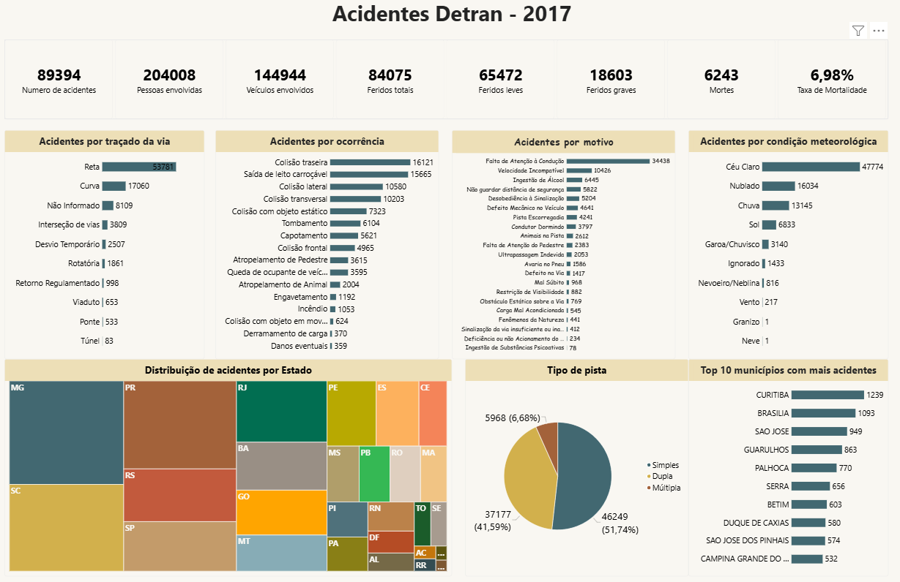
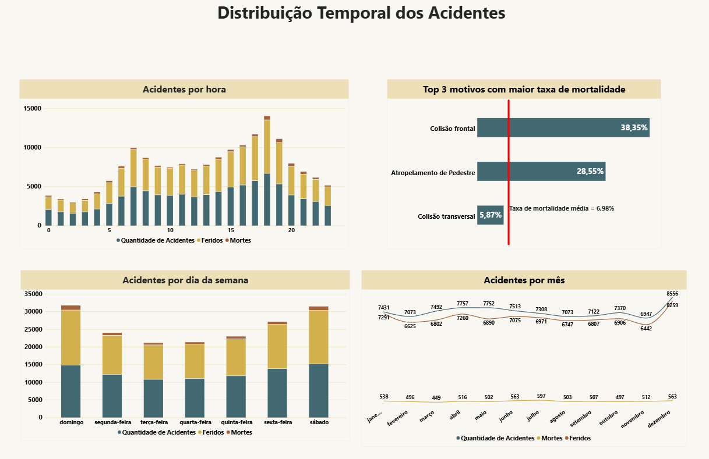

# Dashboard de Acidentes Detran 2017

# Sobre o projeto

Projeto de análise de dados desenvolvido em **Power BI**, com o objetivo de analisar os acidentes ocorridos no Brasil em 2017.
O dashboard busca transformar os dados de acidentes em informações relevantes para identificar padrões relacionados às características das ocorrências, localização, condições meteorológicas e períodos de maior incidência.

# Objetivos da análise

- Avaliar o número de acidentes, pessoas envolvidas, feridos e vítimas fatais.
- Identificar os principais tipos de ocorrência e motivos dos acidentes.
- Analisar os acidentes de acordo com o traçado da via e o tipo de pista.
- Identificar os estados e municípios com maior número de acidentes.
- Identificar os meses, dias da semana e horários com maior incidência de acidentes.
- Analisar os motivos associados às maiores taxas de mortalidade.
  
# Principais indicadores

- | Numero de Acidentes | Resultado |
- | Pessoas Envolvidas | 89394 |
- | Veículos Envolvidos | 204008 |
- | Feridos totais | 84075 |
- | Feridos leves | 65472 |
- | Feridos Graves| 18603 |
- | Mortes| 6243 |
- | Taxa de Mortalidade| 6,98% |

# Principais análises 

# Pagina 1 - Visão geral dos acidentes

# Acidentes por traçado
- Aproximadamente 60% dos acidentes ocorreram em pistas retas, representando a maior concentração entre os tipos de traçado analisados.
# Acidentes por ocorrência
- As colisões traseiras e as saídas de leito carroçável apresentam os maiores volumes entre os tipos de ocorrência registrados.
# Acidentes por motivo
- A falta de atenção à condução e a velocidade incompatível estão entre os principais motivos associados aos acidentes.
# Acidentes por condição meteorológica
- A maior parte dos acidentes ocorreu sob céu claro, seguido por condições de tempo nublado e chuva.
# Distribuição por Estado
- Minas Gerais, Santa Catarina e Paraná apresentam os maiores volumes de acidentes entre os estados analisados.
# Acidentes por tipo de pista
- A maior parte dos acidentes ocorreu em pistas simples, representando mais da metade das ocorrências.
# Municípios com mais acidentes
- Entre os municípios com maior número de acidentes estão Curitiba, Brasília e São José-SC.

# Página 2 — Incidência de acidentes ao longo do tempo

# Acidentes por hora
- Os acidentes apresentam maior concentração nos horários de pico, principalmente entre 6h e 8h e entre 17h e 19h.
# Acidentes dia da semana
- Sexta-feira, sábado e domingo concentram os maiores volumes de acidentes ao longo da semana.
# Top 3 motivos com maior taxa de mortalidade
- A colisão frontal apresenta a maior taxa de mortalidade entre os motivos analisados, atingindo 38,35%.
# Acidentes por mês
- Dezembro e janeiro apresentam os maiores volumes de acidentes. Esse comportamento pode estar relacionado ao aumento do fluxo de veículos durante o período de férias e festas de fim de ano. Entretanto, são necessários dados de outros anos para verificar se esse padrão se mantém e evitar conclusões baseadas em apenas um período.

# Ferramentas utilizadas

- **Power BI**
- **Power Query**
- **DAX**

# Principais conceitos aplicados

- Modelagem de dados
- Relacionamentos entre tabelas
- Transformação de dados com Power Query
- Medidas DAX
- Top N
- KPIs
- Análise exploratória de dados
- Visualização de dados
  
# Insights

- Aproximadamente **60% dos acidentes ocorreram em trechos retos**.
- A **falta de atenção à condução** é o principal motivo registrado para os acidentes.
- **Céu claro** foi a condição meteorológica predominante nas ocorrências.
- **Minas Gerais** apresentou o maior volume de acidentes entre os estados analisados.
- **Sexta-feira, sábado e domingo** concentram grande parte das ocorrências semanais.
- Os horários de **6h–8h e 17h–19h** apresentam maior concentração de acidentes.
- A **colisão frontal** apresenta a maior taxa de mortalidade entre os motivos analisados.
- **Dezembro e janeiro** registraram os maiores volumes de acidentes.

# Autor

Eduardo Silveira
